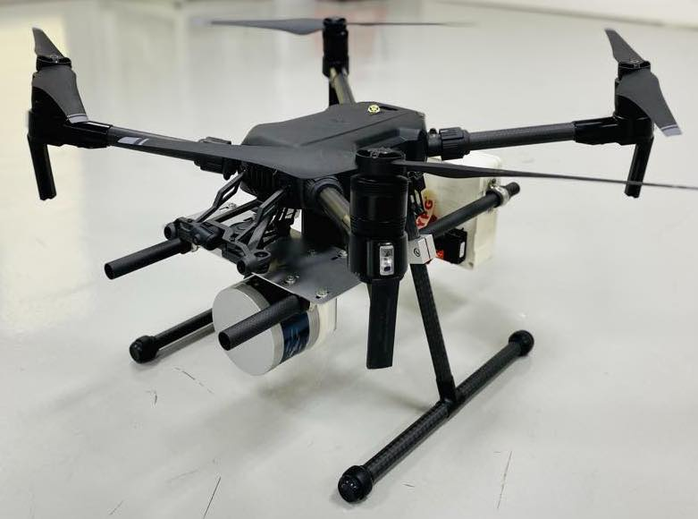
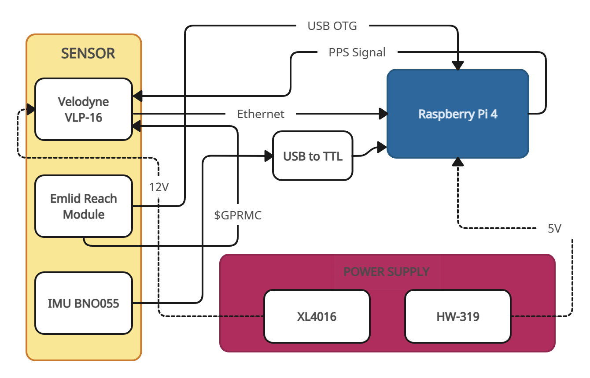

# 3D Point Cloud Terrain Mapping System

In this 3D terrain mapping system, data collection from sensors during the UAV survey is done initially and further offline processing of the data is done to build a 3D map. The implementation of this research uses mainly Robotic Operating System (ROS) based on Raspberry Pi 4 running Ubuntu 18.04. Therefore, the software libraries used for the implementation are divided into two tasks: Data collection and Offline data processing.



Stop Button
---------------
The stop button is used to gracefully stop any ROS bag recordings before shutting down the system to avoid damaging the bag file, this could lead to the missing data.

To create a custom service for the ```shutdown_button.py``` script to run on every startup, you'll need to create a systemd service. This service will ensure that your script runs as a background process during the boot sequence. Follow these steps:

Create a service file for your script. Open a terminal and run:
```
$ sudo nano /etc/systemd/system/shutdown_button.service
```
Paste the following content into the file:
```
[Unit]
Description=Shutdown Button Service
After=network.target

[Service]
ExecStart=/usr/bin/python3 /path/to/your/shutdown_button.py
Restart=always
User=your_username

[Install]
WantedBy=default.target
```
Replace ```/path/to/your/shutdown_button.py``` with the actual path to your ```shutdown_button.py``` script, and replace ```your_username``` with your actual username.

Save the changes and exit the text editor.

Reload the systemd manager configuration:
```
$ sudo systemctl daemon-reload
```
Enable the service to start on boot:
```
$ sudo systemctl enable shutdown_button.service
```
Start the service:
```
$ sudo systemctl start shutdown_button.service
```
Check the status to ensure that the service is running without errors:
```
$ sudo systemctl status shutdown_button.service
```
If everything is set up correctly, you should see that the service is active and running.

Upstart for ROS Robots
---------------
This package aims to assist with creating simple platform-specific jobs to start your robot’s ROS launch files when its PC powers up.

The basic or one-off usage is with the install script, which can be as simple as:
```
$ rosrun robot_upstart install drone/launch/drone.launch
```
This will create a job called ```drone``` on your machine, which launches drone.launch. It will start automatically when you next start your machine, or you can bring it up manually:
```
$ sudo service drone start
```
or down
```
$ sudo service drone stop
```

Data Collection
---------------
The data collection involves collecting data from Velodyne VLP-16 LIDAR, IMU AdaFruit BNO055, Emlid Reach RTK GNSS and Raspberry Pi 4. The sensors data is collected using the ROS bag tool. The system needs to be setup with appropriate ROS drivers to receive data from sensors into ROS architecture. The below figure illustrates architectural diagram of sensor setup used for data collection



Velodyne LIDAR
---------------

Download Velodyne ROS driver using:
```
git clone git@github.com:ros-drivers/velodyne.git
```
To run the Velodyne sensor ROS driver:
```
roslaunch velodyne\_pointcloud VLP16_points.launch
```

Emlid Reach RTK
---------------

The NMEA sentences from the Emlid Reach and GNSS UTC can be logged using the nmea_navsat driver. This driver is forked from 
```
https://github.com/ros-drivers/nmea_navsat_driver
```

To run the driver:
```
roslaunch nmea_navsat_driver nmea_serial_driver.launch
```

IMU BNO055
---------------

Download BNO055 ROS driver using:
```
git clone git@github.com:RoboticArts/ros_imu_bno055.git
```
To run the Velodyne sensor ROS driver:
```
roslaunch ros_imu_bno055 imu.launch serial_port:=/dev/ttyUSB0 operation_mode:=NDOF
```

Offline Data Processing
---------------
In this step, the data collected from all the sensors are processed to generate a 3D point cloud. The process involves generating the optimal pose of the UAV by sensor fusion and using it for Georeferencing LIDAR point cloud. 

The ROS bags collected in the data collection stage/datasets are played by:
```
rosbag play xxx.bag
```

PointCloud Conversion
---------------
Using PCL library to convert pointclouds from a bag file to PCD's for generating 3D map
```
$ rosrun pcl_ros bag_to_pcd <input_file.bag> /velodyne_points <output_directory>
```
Save the PCD files to a folder for further process.

IMU Data Conversion
---------------
Run the ```imu_to_csv.py``` script to save the IMU data in Quaternions format:
```
python3 imu_to_csv.py
```
Save the csv file

Georeferencing 3D Point Cloud Map
----------------
The pointcloud fromm LIDAR frame are transformed to UAV baselink/IMU link and then transformed to maping frame using the below equation

$$x^e(t) = g^e(t) + R^e_n(t) \cdot R^n_s(t) \cdot x^s(t)$$

A Python program is constructed include all the georeferencing algorithms to generate a 3D point cloud map from 3 datasets: PCD files, IMU data, GPS data.

Run the mapping application:

```
python3 georeference.py
```
The result will be saved in LAS format and can be visualized on CloudCompare.
